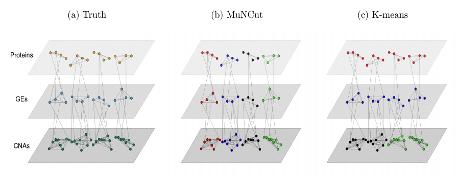

---
output:
  md_document:
    variant: markdown_github
---
[](https://www.gnu.org/licenses/gpl-3.0.en.html)
 
---
 
 
---
 
[](https://www.gnu.org/licenses/gpl-3.0.en.html)
 
---
 
 
---
 
[](https://www.gnu.org/licenses/gpl-3.0.en.html)
 
---
 
 
---
 
[](https://www.gnu.org/licenses/gpl-3.0.en.html)
 
---
 
 
---
 
[](https://www.gnu.org/licenses/gpl-3.0.en.html)
[](https://travis-ci.org/yourgithubname/yourpackagename)
 
---
 
 
---
 
[](http://www.repostatus.org/#wip)
[](https://www.gnu.org/licenses/gpl-3.0.en.html)
 
---
 
[](https://cran.r-project.org/)
[](https://cran.r-project.org/package=NCutYX)
[](commits/master)
 
---
 
[)`-yellowgreen.svg)](/commits/master)

<!-- README.md is generated from README.Rmd. Please edit that file -->

```{r, echo = FALSE}
knitr::opts_chunk$set(
  collapse = TRUE,
  comment = "#>",
  fig.path = "README-"
)
```

# The NCutYX package
# Sebastian Jose Teran Hidalgo

# Table of contents
1. [Description](#description)
2. [NCut](#ncut)
3. [ANCut](#ancut)
4. [MuNCut](#muncut)
5. [PWNCut](#pwncut)
6. [MLBNCut](#mlbncut)
7. [AWNCut](#awncut)


# Description

The NCutYX package includes functions for clustering genomic data using graph theory. Each function in this package is a variation on the NCut measure used to cluster vertices in a graph. The running theme is to use data sets from different sources and types to improve the clustering results.

* The ncut function clusters the columns of a data set using the classical normalized cut measure from graph theory. 
* The ancut function clusters one type of data, say gene expressions, with the help of a second type of data, like copy number aberrations.
* The muncut function clusters a three-layered graph into K different clusters of 3 different data types, say gene expression, copy number aberrations and proteins. 
* The pwncut function clusters the columns of X into K clusters by giving a weight for each cluster while penalizing them to be similar to each other.
* The mlbncut function works similarly to muncut but it also clusters samples 
into R clusters.
* The awncut builds similarity matrices for the row of X and an assisted dataset Z. Clusters them into K groups while conducting feature selection based on the AWNCut method.


To install:

* latest development version: 
    1. install and load package devtools
    2. `install_github("Seborinos/NCutYX")`

# NCut

The Normalized Cut (NCut) clusters the columns of Y into K groups using the NCut graph measure. Builds a similarity matrix for the columns of Y and clusters them into K groups based on the NCut graph measure. Correlation, Euclidean and Gaussian distances can be used to construct the similarity matrix. The NCut measure is minimized using the cross entropy method, a Monte Carlo optimization technique. 

## Example

First, we set up the simulation parameters.
```{r eval=FALSE}
library(MASS)
n <- 100 # Sample size
B <- 30 # Number of iterations in the simulated annealing algorithm.
p <- 50 # Number of columns of Y.
```

We define the covariance matrix, the true incidence function and sample the data.
```{r eval=FALSE}
S <- matrix(0.2, p, p)
S[1:(p/2),(p/2+1):p] <- 0
S[(p/2+1):p,1:(p/2)] <- 0
S <- S-diag(diag(S)) + diag(p)
mu <- rep(0, p)

W0 <- matrix(1,p,p)
W0[1:(p/2),1:(p/2)] <- 0
W0[(p/2+1):p,(p/2+1):p] <- 0
Denum <- sum(W0)

Y <- mvrnorm(n, mu, S)
```

Apply ncut to the data Y and calculate the estimation error of the clusters.
```{r eval=FALSE}
Res <- ncut(Y,
            K     = 2,
            B     = 30,
            N     = 1000,
            dist  = 'correlation',
            scale = TRUE,
            q     = 0.2,
            sigma = 0.1)
            
Cx  <- Res[[2]]
f11 <- matrix(Cx[ ,1], p, 1)
f12 <- matrix(Cx[ ,2], p, 1)

errorL <- sum((f11%*%t(f11))*W0)/Denum + sum((f12%*%t(f12))*W0)/Denum
# This is the true error of the clustering solution.
errorL
```

# ANCut

The Assisted NCut (ANcut) clusters the columns of a data set Y into K groups with the help of an external data set X, which is associated linearly with Y.  

## Simulation Example

First we define some of the simulation parameters below.
```{r eval=FALSE}
n  <- 200 # Sample size
B  <- 5000 # Number of iterations in the simulated annealing algorithm.
L  <- 10000 # Temperature coefficient.
p  <- 200 # Number of columns of Y.
q  <- p # Number of columns of X.
h1 <- 0.05 # Lower bound for the B coefficiens in Y = X*B+e.
h2 <- 0.15 # Upper bound for the B coefficients in the model Y = X*B+e.
```
 
The data will be simulated as `Y = X*B + e` where X will be normal with a convariance matrix S with 2 blocks of correlated variables. This induces the correlation among the Y's as well. `W0` is an incidence matrix that will be used to calculate the error of the procedure.
```{r eval=FALSE}
 S <- matrix(0.2,q,q)
 S[1:(q/2),(q/2+1):q] <- 0
 S[(q/2+1):q,1:(q/2)] <- 0
 S <- S - diag(diag(S)) + diag(q)
 
 mu <- rep(0,q)

 W0 <- matrix(1,p,p)
 W0[1:(p/2),1:(p/2)] <- 0
 W0[(p/2+1):p,(p/2+1):p] <- 0

 B <- matrix(0,q,p)
 for (i in 1:(p/2)){
    B[1:(q/2),i] <- runif(q/2,h1,h2)
    in1          <- sample.int(q/2,6)
    B[-in1,i]    <- 0#This makes B sparse.
 }

 for (i in (p/2+1):p){
    B[(q/2+1):q,i] <- runif(q/2,h1,h2)
    in2            <- sample(seq(q/2+1,q),6)
    B[-in2,i]      <- 0 # This makes B sparse.
 }

 X <- mvrnorm(n, mu, S)
 Z <- X%*%B
 Y <- Z + matrix(rnorm(n*p,0,2),n,p)
```
We apply the function ANCut to Y which will cluster the columns into K=2 groups. It uses the help of X. First, it creates a model of Y=XB+e using the elastic net. You can choose the number of cross-validations with ncv and the parameter alpha in the penalty of the elastic net. 

```{r eval=FALSE}
# ANCut method
Res <- anut(Y, X, B, L, K=2, alpha = 0, ncv = 5)
Cx  <- Res[[2]]
f11 <- matrix(Cx[,1],p,1)
f12 <- matrix(Cx[,2],p,1)

errorL <- sum((f11%*%t(f11))*W0)/Denum+sum((f12%*%t(f12))*W0)/p^2
# This is the true error of the clustering solution.
errorL
```
 
If you wish to plot the results you can do:
```{r eval=FALSE}
# Below is a plot of the simulated annealing path.
plot(Res[[1]], type='l')
#Cluster found by ANCut
image.plot(Cx)
```
 On the left panel we see the path of the objective function as it is minimized through simulated annealing. On the right are represented the clusters. The perfect solution is a perfect checker board panel and the ANCut solution misses slightly. As n or h2 are increased, the solution will get closer to the true cluster structure of the data.


## References:

* [Hidalgo, Sebastian J. Teran, Mengyun Wu, and Shuangge Ma. "Assisted clustering of gene expression data using ANCut." *BMC genomics* 18.1 (2017): 623.](https://www.ncbi.nlm.nih.gov/pmc/articles/PMC5559859/)

# MuNCut

This example shows how to use the muncut function. MuNCut clusters the columns of data from 3 different sources. It clusters the columns of Z, Y and X into K clusters by representing each data type as one network layer. It represents the Z layer depending on Y, and the Y layer depending on X. Elastic net can be used before the clustering procedure by using the predictions of Z and Y instead of the actual values to improve the cluster results. The function muncut will output K clusters of columns of Z, Y and X.

{width=275px, height=275px}

## Simulation Example
First, we define the simulation parameters, including the covariance matrix S of the X's.
```{r eval=FALSE}
n   <- 50
p   <- 50
h   <- 0.5
rho <- 0.5

Sigma <- matrix(rho,p,p)
Sigma[1:(p/5),1:(p/5)] <- 2*rho
Sigma[(p/5+1):(3*p/5),(p/5+1):(3*p/5)] <- 2*rho
Sigma[(3*p/5+1):(4*p/5),(3*p/5+1):(4*p/5)] <- 2*rho
Sigma <- Sigma - diag(diag(Sigma))
Sigma <- Sigma + diag(p)
```

The matrix W0 will be used to evaluate how close the estimate is to the true cluster structure.
```{r eval=FALSE}
W0 <- matrix(1,p,p)
W0[1:(p/5),1:(p/5)] <- 0
W0[(p/5+1):(3*p/5),(p/5+1):(3*p/5)] <- 0
W0[(3*p/5+1):(4*p/5),(3*p/5+1):(4*p/5)] <- 0
W0[(4*p/5+1):p,(4*p/5+1):p] <- 0
W0 <- cbind(W0,W0,W0)
W0 <- rbind(W0,W0,W0)
```

The code below shows how to sample the data from three layers. The multilayer network is such that $\mathbf{X}$ is the base layer, $\mathbf{Y}$ is the second layer which depends on $\mathbf{X}$, and $\mathbf{Z}$ is the third layer which depends on $\mathbf{Y}$.
```{r eval=FALSE}
Y <- matrix(0, n, p)
Z <- matrix(0, n, p)

X  <- mvrnorm(n, rep(0, p), Sigma)
B1 <- matrix(0, p, p)
B2 <- matrix(0, p, p)

B1[1:(p/5),1:(p/5)]                     <- runif((p/5)^2, h/2, h)*rbinom((p/5)^2, 1, 0.2)
B1[(p/5+1):(3*p/5),(p/5+1):(3*p/5)]     <- runif((2*p/5)^2, h/2, h)*rbinom((2*p/5)^2, 1, 0.2)
B1[(3*p/5+1):(4*p/5),(3*p/5+1):(4*p/5)] <- runif((p/5)^2, h/2, h)*rbinom((p/5)^2, 1, 0.2)

B2[1:(p/5),1:(p/5)]                     <- runif((p/5)^2, h/2, h)*rbinom((p/5)^2, 1, 0.2)
B2[(p/5+1):(3*p/5),(p/5+1):(3*p/5)]     <- runif((2*p/5)^2, h/2, h)*rbinom((2*p/5)^2, 1, 0.2)
B2[(3*p/5+1):(4*p/5),(3*p/5+1):(4*p/5)] <- runif((p/5)^2, h/2, h)*rbinom((p/5)^2, 1, 0.2)

Y <- X%*%B1 + matrix(rnorm(n*p, 0, 0.5), n, p)
Z <- Y%*%B2 + matrix(rnorm(n*p, 0, 0.5), n, p)
```

The code below computes clusters using the MuNCut measure. With `model = FALSE` the raw data $\mathbf{Y}$ and $\mathbf{Z}$ are used. If `model = TRUE`, the predictions $\widehat{\mathbf{Y}}$ and $\widehat{\mathbf{Z}}$ are used instead of $\mathbf{Y}$ and $\mathbf{Z}$, respectively.
```{r eval=FALSE}
clust <- muncut(Z,
                Y,
                X,
                K        = 4,
                B        = 15000,
                L        = 500,
                sampling = 'size',
                alpha    = 0.5,
                ncv      = 3,
                nlambdas = 20,
                sigma    = 10,
                scale    = TRUE,
                model    = FALSE,
                gamma    = 0.1)

A <- clust[[2]][ ,1]%*%t(clust[[2]][ ,1]) + clust[[2]][ ,2]%*%t(clust[[2]][ ,2]) +
     clust[[2]][ ,3]%*%t(clust[[2]][ ,3]) + clust[[2]][ ,4]%*%t(clust[[2]][ ,4])

errorK <- sum(A*W0)/(3*p)^2
errorK
```


### References:

* Sebastian J. Teran Hidalgo and Shuangge Ma. "Clustering Multilayer Omics Data using MuNCut." *Revise and resubmit.*  

## PWNCut

The Penalized Weighted NCut (PWNCut) clusters the columns of X into K clusters by giving a weighted cluster membership while shrinking weights towards each other.

### Simulation Example
This sets up the initial parameters for the simulation.
```{r eval=FALSE}
n <- 100 # Sample size
p <- 100 # Number of columns of Y.
K <- 3
```

This simulates the data:
```{r eval=FALSE}
C0            <- matrix(0,p,K)
C0[1:25,1]    <- matrix(1,25,1)
C0[26:75,1:3] <- matrix(1/3,50,3)
C0[76:100,3]  <- matrix(1,25,1)

A0 <- C0[ ,1]%*%t(C0[ ,1]) + C0[ ,2]%*%t(C0[ ,2]) +
      C0[ ,3]%*%t(C0[ ,3])
A0 <- A0 - diag(diag(A0)) + diag(p)

Z1 <- rnorm(n,0,2)
Z2 <- rnorm(n,0,2)
Z3 <- rnorm(n,0,2)

Y <- matrix(0,n,p)
Y[ ,1:25]   <-  matrix(rnorm(n*25, 0, 2), n, 25) + matrix(Z1, n, 25, byrow=FALSE)
Y[ ,26:75]  <-  matrix(rnorm(n*50, 0, 2), n, 50) + matrix(Z1, n, 50, byrow=FALSE) +
                matrix(Z2, n, 50, byrow=FALSE) + matrix(Z3, n, 50, byrow=FALSE)
Y[ ,76:100] <-  matrix(rnorm(n*25, 0, 2), n, 25) + matrix(Z3, n, 25, byrow=FALSE)
```

To use PWNCut use the function `pwncut`.
```{r eval=FALSE}
trial <- pwncut(Y,
                K       = 3,
                B       = 10000,
                L       = 1000,
                lambda  = 1.5,
                start   = 'default',
                scale   = TRUE,
                nstarts = 1,
                epsilon = 0,
                dist    = 'correlation',
                sigma   = 10)

A1 <- trial[[2]][ ,1]%*%t(trial[[2]][ ,1]) +
      trial[[2]][ ,2]%*%t(trial[[2]][ ,2]) +
      trial[[2]][ ,3]%*%t(trial[[2]][ ,3])

A1 <- A1 - diag(diag(A1)) + diag(p)

plot(trial[[1]], type='l')
errorL <- sum(abs(A0-A1))/p^2
errorL
```

### References: 

* Sebastian J. Teran Hidalgo, Mengyun Wu and Shuangge Ma. "Penalized and weighted clustering of gene expression data using PWNCut." *Submitted.* 

## MLBNCut

The Multilayer Biclustering NCut (MLBNCut) clusters the columns and the rows simultaneously of data from 3 different sources. It clusters the columns of Z,Y and X into K clusters and the samples into R clusters by representing each data type as one network layer. It represents the Z layer depending on Y, and the Y layer depending on X. This function will output K clusters of columns of Z, Y and X and R clusters of the samples.

### Simulation Example
This sets up the initial parameters for the simulation.
```{r eval=FALSE}
n   <- 50
p   <- 50
h   <- 0.15
rho <- 0.15
mu  <- 1
```

```{r eval=FALSE}
W0 <- matrix(1,p,p)
W0[1:(p/5),1:(p/5)] <- 0
W0[(p/5+1):(3*p/5),(p/5+1):(3*p/5)] <- 0
W0[(3*p/5+1):(4*p/5),(3*p/5+1):(4*p/5)] <- 0
W0[(4*p/5+1):p,(4*p/5+1):p]=0
W0=cbind(W0,W0,W0)
W0=rbind(W0,W0,W0)

W1 <- matrix(1,n,n)
W1[1:(n/2),1:(n/2)] <- 0
W1[(n/2+1):n,(n/2+1):n] <- 0
```

```{r eval=FALSE}
X <- matrix(0,n,p)
Y <- matrix(0,n,p)
Z <- matrix(0,n,p)

Sigma=matrix(0,p,p)
Sigma[1:(p/5),1:(p/5)] <- rho
Sigma[(p/5+1):(3*p/5),(p/5+1):(3*p/5)] <- rho
Sigma[(3*p/5+1):(4*p/5),(3*p/5+1):(4*p/5)] <- rho
Sigma[(4*p/5+1):p,(4*p/5+1):p] <- rho
Sigma <- Sigma - diag(diag(Sigma))
Sigma <- Sigma + diag(p)

X[1:(n/2),]   <- mvrnorm(n/2,rep(mu,p),Sigma)
X[(n/2+1):n,] <- mvrnorm(n/2,rep(-mu,p),Sigma)

B11 <- matrix(0,p,p)
B12 <- matrix(0,p,p)
B21 <- matrix(0,p,p)
B22 <- matrix(0,p,p)

B11[1:(p/5),1:(p/5)]                     <- runif((p/5)^2, h/2, h)*rbinom((p/5)^2, 1, 0.5)
B11[(p/5+1):(3*p/5),(p/5+1):(3*p/5)]     <- runif((2*p/5)^2, h/2, h)*rbinom((2*p/5)^2, 1, 0.5)
B11[(3*p/5+1):(4*p/5),(3*p/5+1):(4*p/5)] <- runif((p/5)^2, h/2, h)*rbinom((p/5)^2, 1, 0.5)
B11[(4*p/5+1):p,(4*p/5+1):p]             <- runif((1*p/5)^2, h/2, h)*rbinom((1*p/5)^2, 1, 0.5)

B12[1:(p/5),1:(p/5)]                     <- runif((p/5)^2, -h, -h/2)*rbinom((p/5)^2, 1, 0.5)
B12[(p/5+1):(3*p/5),(p/5+1):(3*p/5)]     <- runif((2*p/5)^2, -h, -h/2)*rbinom((2*p/5)^2, 1, 0.5)
B12[(3*p/5+1):(4*p/5),(3*p/5+1):(4*p/5)] <- runif((p/5)^2, -h, -h/2)*rbinom((p/5)^2, 1, 0.5)
B12[(4*p/5+1):p,(4*p/5+1):p]             <- runif((1*p/5)^2, -h, -h/2)*rbinom((1*p/5)^2, 1, 0.5)

B21[1:(p/5),1:(p/5)]                     <- runif((p/5)^2, h/2, h)*rbinom((p/5)^2,1,0.5)
B21[(p/5+1):(3*p/5),(p/5+1):(3*p/5)]     <- runif((2*p/5)^2, h/2, h)*rbinom((2*p/5)^2,1,0.5)
B21[(3*p/5+1):(4*p/5),(3*p/5+1):(4*p/5)] <- runif((p/5)^2, h/2, h)*rbinom((p/5)^2,1,0.5)
B21[(4*p/5+1):p,(4*p/5+1):p]             <- runif((1*p/5)^2, h/2, h)*rbinom((1*p/5)^2,1,0.5)

B22[1:(p/5),1:(p/5)]                     <- runif((p/5)^2, -h, -h/2)*rbinom((p/5)^2, 1, 0.5)
B22[(p/5+1):(3*p/5),(p/5+1):(3*p/5)]     <- runif((2*p/5)^2, -h, -h/2)*rbinom((2*p/5)^2, 1, 0.5)
B22[(3*p/5+1):(4*p/5),(3*p/5+1):(4*p/5)] <- runif((p/5)^2, -h, -h/2)*rbinom((p/5)^2, 1, 0.5)
B22[(4*p/5+1):p,(4*p/5+1):p]             <- runif((1*p/5)^2, -h, -h/2)*rbinom((1*p/5)^2, 1, 0.5)

Y[1:(n/2), ]   <- X[1:(n/2),]%*%B11+matrix(rnorm((n/2)*p, 0, 0.25), n/2, p)
Y[(n/2+1):n, ] <- X[(n/2+1):n,]%*%B12+matrix(rnorm((n/2)*p, 0, 0.25), n/2, p)

Z[1:(n/2), ]   <- Y[1:(n/2),]%*%B21+matrix(rnorm((n/2)*p, 0, 0.25),n/2,p)
Z[(n/2+1):n, ] <- Y[(n/2+1):n,]%*%B22+matrix(rnorm((n/2)*p, 0, 0.25),n/2,p)
```


```{r eval=FALSE}
trial <- mlbncut(Z,
                 Y,
                 X,
                 K=4,
                 R=2,
                 B=10,
                 N=100,
                 dist='correlation',
                 q0=0.15,
                 scale=TRUE,
                 sigmas=0.05,
                 sigmac=1)

plot(trial[[1]],type='l')
image.plot(trial[[2]])
image.plot(trial[[3]])

errorK <- sum((trial[[3]][ ,1]%*%t(trial[[3]][ ,1]) +
               trial[[3]][ ,2]%*%t(trial[[3]][ ,2]) +
               trial[[3]][ ,3]%*%t(trial[[3]][ ,3]) +
               trial[[3]][ ,4]%*%t(trial[[3]][ ,4]))*W0)/(3*p)^2 +
          sum((trial[[2]][ ,1]%*%t(trial[[2]][ ,1]) +
               trial[[2]][ ,2]%*%t(trial[[2]][ ,2]))*W1)/(n)^2
errorK
```

### References: 

* Sebastian J. Teran Hidalgo and Shuangge Ma. "Multilayer Biclustering of Omics Data using MLBNCut." *Work in progress.* 

## AWNCut

The Assisted Weighted NCut builds the similarity matrices for the rows of X and an assisted dataset Z. Clusters them into K groups while conducting feature selection based on the AWNCut method.

### Simulation Example

```{r eval=FALSE}
set.seed(123456)
#This sets up the initial parameters for the simulation.
lambda <- seq(2,6,1) #Tuning parameter lambda
Tau    <- seq(0.2,0.8,0.2) #Tuning parameter tau

n=30; n1=10; n2=10; n3=n-n1-n2 #Sample size
p1=30; p2=30; r1=28; r2=28; #Number of variables and noises in each dataset

K=3; #Number of clusters

mu=1; #Mean of the marginal distribution
u1=0.5; #Range of enties in the coefficient matrix

epsilon <- matrix(rnorm(n*(p1-r1),0,1), n, (p1-r1)) # Generation of random error

Sigma1 <- matrix(rep(0.8,(p1-r1)^2),(p1-r1),(p1-r1)) # Generation of the covariance matrix
diag(Sigma1) <- 1
```

```{r eval=FALSE}
# Generation of the original distribution of the three clusters
T1 <- matrix(rmvnorm(n1,mean=rep(-mu,(p1-r1)),sigma=Sigma1),n1,(p1-r1))
T2 <- matrix(rmvnorm(n2,mean=rep(0,(p1-r1)),sigma=Sigma1),n2,(p1-r1))
T3 <- matrix(rmvnorm(n3,mean=rep(mu,(p1-r1)),sigma=Sigma1),n3,(p1-r1))

X1 <- sign(T1)*(exp(abs(T1))) #Generation of signals in X
X2 <- sign(T2)*(exp(abs(T2)))
X3 <- sign(T3)*(exp(abs(T3)))
ep1 <- (matrix(rnorm(n*r1,0,1),n,r1)) #Generation of noises in X
X <- rbind(X1,X2,X3)

beta1 <- matrix(runif((p1-r1)*(p2-r2),-u1,u1),(p1-r1),(p2-r2)) #Generation of the coefficient matrix
Z     <- X%*%beta1+epsilon #Generation of signals in Z
ep2   <- (matrix(rnorm(n*r2,0.5,1),n,r2)) #Generation of noises in Z

X <- cbind(X,ep1)
Z <- cbind(Z,ep2)
```

```{r eval=FALSE}
# AWNCut method
Tune1         <- awncut.selection(X, Z, K, lambda, Tau, B = 30, L = 1000)
awncut.result <- awncut(X, Z, 3, Tune1$lam, Tune1$tau, B = 30, L = 1000)
ErrorRate(awncut.resu
```

### References: 

* Li, Yang; Bie, Ruofan; Teran Hidalgo, Sebastian; Qin, Yinchen; Wu, Mengyun; Ma, Shuangge. "Assisted gene expression-based clustering with AWNCut." *Submitted.* 
