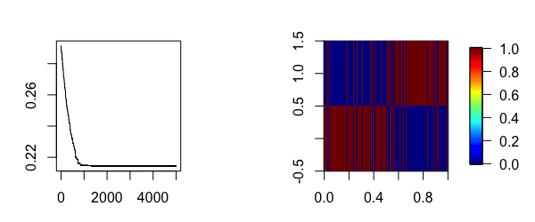

[](http://www.repostatus.org/#wip) [](https://www.gnu.org/licenses/gpl-3.0.en.html)

------------------------------------------------------------------------

[](https://cran.r-project.org/) [](https://cran.r-project.org/package=NCutYX) [](commits/master)

------------------------------------------------------------------------

[](/commits/master)

<!-- README.md is generated from README.Rmd. Please edit that file -->
The NCutYX package
==================

Sebastian Jose Teran Hidalgo
============================

Table of contents
=================

1.  [Description](#description)
2.  [NCut](#ncut)
3.  [ANCut](#ancut)
4.  [MuNCut](#muncut)
5.  [PWNCut](#pwncut)
6.  [AWNCut](#awncut)

Description
===========

The NCutYX package includes functions on clustering genomic data using graph theory.

-   The function ncut clusters the columns of a data set using the classical NCut measure from graph theory.
-   The current version contains the function ancut that clusters one type of data genomic data, say gene expressions, with the help of a second type of data, like copy number aberrations.
-   The function LNCut clusters a three-layered graph into K different channels of 3 types of of genomic data.

To install:

-   latest development version:
    1.  install and load package devtools
    2.  `install_github("Seborinos/NCutYX")`

NCut
====

Cluster the columns of Y into K groups using the NCut graph measure. Builds a similarity matrix for the columns of Y and clusters them into K groups based on the NCut graph measure. Correlation, Euclidean and Gaussian distances can be used to construct the similarity matrix. The NCut measure is minimized using the cross entropy method, a monte carlo optimization technique.

Example
-------

First, we set up the simulation parameters.

``` r
library(MASS)
n <- 100 # Sample size
B <- 30 # Number of iterations in the simulated annealing algorithm.
p <- 50 # Number of columns of Y.
```

We define the covariance matrix, the true incidence function and sample the data.

``` r
S <- matrix(0.2, p, p)
S[1:(p/2),(p/2+1):p] <- 0
S[(p/2+1):p,1:(p/2)] <- 0
S <- S-diag(diag(S)) + diag(p)
mu <- rep(0, p)

W0 <- matrix(1,p,p)
W0[1:(p/2),1:(p/2)] <- 0
W0[(p/2+1):p,(p/2+1):p] <- 0
Denum <- sum(W0)

Y <- mvrnorm(n, mu, S)
```

Apply ncut to the data Y and calculate the estimation error of the clusters.

``` r
Res <- ncut(Y,
            K     = 2,
            B     = 30,
            N     = 1000,
            dist  = 'correlation',
            scale = TRUE,
            q     = 0.2,
            sigma = 0.1)
            
Cx  <- Res[[2]]
f11 <- matrix(Cx[ ,1], p, 1)
f12 <- matrix(Cx[ ,2], p, 1)

errorL <- sum((f11%*%t(f11))*W0)/Denum + sum((f12%*%t(f12))*W0)/Denum
# This is the true error of the clustering solution.
errorL
```

ANCut
=====

Assisted NCut (ANcut) clusters the columns of a data set Y into K groups with the help of an external data set X.

Simulation Example
------------------

First we define some of the simulation parameters below.

``` r
n  <- 200 # Sample size
B  <- 5000 # Number of iterations in the simulated annealing algorithm.
L  <- 10000 # Temperature coefficient.
p  <- 200 # Number of columns of Y.
q  <- p # Number of columns of X.
h1 <- 0.05 # Lower bound for the B coefficiens in Y = X*B+e.
h2 <- 0.15 # Upper bound for the B coefficients in the model Y = X*B+e.
```

The data will be simulated as Y = X\*B+e where X will be normal with a convariance matrix S with 2 blocks of correlated variables. This induces the correlation among the Y's as well. W0 is an incidence matrix that will be used to calculate the error of the procedure.

``` r
 S <- matrix(0.2,q,q)
 S[1:(q/2),(q/2+1):q] <- 0
 S[(q/2+1):q,1:(q/2)] <- 0
 S <- S - diag(diag(S)) + diag(q)
 
 mu <- rep(0,q)

 W0 <- matrix(1,p,p)
 W0[1:(p/2),1:(p/2)] <- 0
 W0[(p/2+1):p,(p/2+1):p] <- 0

 B <- matrix(0,q,p)
 for (i in 1:(p/2)){
    B[1:(q/2),i] <- runif(q/2,h1,h2)
    in1          <- sample.int(q/2,6)
    B[-in1,i]    <- 0#This makes B sparse.
 }

 for (i in (p/2+1):p){
    B[(q/2+1):q,i] <- runif(q/2,h1,h2)
    in2            <- sample(seq(q/2+1,q),6)
    B[-in2,i]      <- 0 # This makes B sparse.
 }

 X <- mvrnorm(n, mu, S)
 Z <- X%*%B
 Y <- Z + matrix(rnorm(n*p,0,2),n,p)
```

We apply the function ANCut to Y which will cluster the columns into K=2 groups. It uses the help of X. First, it creates a model of Y=XB+e using the elastic net. You can choose the number of cross-validations with ncv and the parameter alpha in the penalty of the elastic net.

``` r
# ANCut method
Res <- anut(Y, X, B, L, K=2, alpha = 0, ncv = 5)
Cx  <- Res[[2]]
f11 <- matrix(Cx[,1],p,1)
f12 <- matrix(Cx[,2],p,1)

errorL <- sum((f11%*%t(f11))*W0)/Denum+sum((f12%*%t(f12))*W0)/p^2
# This is the true error of the clustering solution.
errorL
```

If you wish to plot the results you can do:

``` r
# Below is a plot of the simulated annealing path.
plot(Res[[1]], type='l')
#Cluster found by ANCut
image.plot(Cx)
```

On the left panel we see the path of the objective function as it is minimized through simulated annealing. On the right are represented the clusters. The perfect solution is a perfect checker board panel and the ANCut solution misses slightly. As n or h2 are increased, the solution will get closer to the true cluster structure of the data.



References:
-----------

-   [Hidalgo, Sebastian J. Teran, Mengyun Wu, and Shuangge Ma. "Assisted clustering of gene expression data using ANCut." *BMC genomics* 18.1 (2017): 623.](https://www.ncbi.nlm.nih.gov/pmc/articles/PMC5559859/)

MuNCut
======

This example shows how to use the muncut function. MuNCut clusters the columns of data from 3 different sources. It clusters the columns of Z, Y and X into K clusters by representing each data type as one network layer. It represents the Z layer depending on Y, and the Y layer depending on X. Elastic net can be used before the clustering procedure by using the predictions of Z and Y instead of the actual values to improve the cluster results. The function muncut will output K clusters of columns of Z, Y and X.

Simulation Example
------------------

``` r
n   <- 200  # Number of samples
p   <- 400  # Number of variables
h   <- 0.15 # This should be fine. In the previous paper I did h=0.15,0.25
rho <- 0.2  # 0.20 and 0.40 
```

``` r
W0=matrix(1,p,p)
W0[1:(p/5),1:(p/5)]=0
W0[(p/5+1):(3*p/5),(p/5+1):(3*p/5)]=0
W0[(3*p/5+1):(4*p/5),(3*p/5+1):(4*p/5)]=0
W0[(4*p/5+1):p,(4*p/5+1):p]=0
W0=cbind(W0,W0,W0)
W0=rbind(W0,W0,W0)
```

``` r
  #Simulating the data
  Y=matrix(0,n,p)
  Z=matrix(0,n,p)
  Sigma=matrix(0,p,p)
  Sigma[1:(p/5),1:(p/5)]=rho
  Sigma[(p/5+1):(3*p/5),(p/5+1):(3*p/5)]=rho
  Sigma[(3*p/5+1):(4*p/5),(3*p/5+1):(4*p/5)]=rho
  Sigma=Sigma-diag(diag(Sigma))
  Sigma=Sigma+diag(p)
  Sigma=matrix(rho,p,p)
  Sigma[1:(p/5),1:(p/5)]=2*rho
  Sigma[(p/5+1):(3*p/5),(p/5+1):(3*p/5)]=2*rho
  Sigma[(3*p/5+1):(4*p/5),(3*p/5+1):(4*p/5)]=2*rho
  Sigma=Sigma-diag(diag(Sigma))
  Sigma=Sigma+diag(p)  
  X=mvrnorm(n,rep(0,p),Sigma)
  B1=matrix(0,p,p)
  B2=matrix(0,p,p)
  
  B1[1:(p/5),1:(p/5)]=runif((p/5)^2,h/2,h)*rbinom((p/5)^2,1,0.2)
  B1[(p/5+1):(3*p/5),(p/5+1):(3*p/5)]=runif((2*p/5)^2,h/2,h)*rbinom((2*p/5)^2,1,0.2)
  B1[(3*p/5+1):(4*p/5),(3*p/5+1):(4*p/5)]=runif((p/5)^2,h/2,h)*rbinom((p/5)^2,1,0.2)
  #
  B2[1:(p/5),1:(p/5)]=runif((p/5)^2,h/2,h)*rbinom((p/5)^2,1,0.2)
  B2[(p/5+1):(3*p/5),(p/5+1):(3*p/5)]=runif((2*p/5)^2,h/2,h)*rbinom((2*p/5)^2,1,0.2)
  B2[(3*p/5+1):(4*p/5),(3*p/5+1):(4*p/5)]=runif((p/5)^2,h/2,h)*rbinom((p/5)^2,1,0.2)
  
  Y=X%*%B1+matrix(rnorm(n*p,0,0.5),n,p)
  Y2=X%*%B1
  
  Z=Y%*%B2+matrix(rnorm(n*p,0,0.5),n,p)
  Z2=Y%*%B2
  
  #Computing LayerNCut
  clust<-LayerNCut(Z,Y,X,K=4,B=10000,L=10000,alpha=0,ncv=3,nlambdas=30,scale=F,model=F,gamma=0.5)
  errorK=sum((trial1[[2]][,1]%*%t(trial1[[2]][,1])+trial1[[2]][,2]%*%t(trial1[[2]][,2])+trial1[[2]][,3]%*%t(trial1[[2]][,3])+
                   trial1[[2]][,4]%*%t(trial1[[2]][,4]))*W0)/(3*p)^2
```


### References:

-   Sebastian J. Teran Hidalgo and Shuangge Ma. "Clustering Multilayer Omics Data using MuNCut." *Revise and resubmit.*

PWNCut
------

MLBNCut
-------

AWNCut
------
