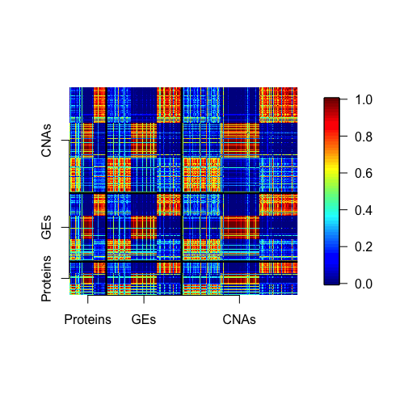

# The NCutYX package
# Sebastian Jose Teran Hidalgo

[Description](#Description)
[ANCut](#ANCut)
[MuNCut](#MuNCut)
[SpaWN](#SpaWN)
# Description

The NCutYX package includes functions on clustering genomic data using graph theory. 

* The current version contains the function ANCut that clusters one type of data genomic data, say gene expressions, with the help of a second type of data, like copy number aberrations. 
* The function LNCut clusters a three-layered graph into K different channels of 3 types of of genomic data. 

To install:

* latest development version: 
    1. install and load package devtools
    1. `install_github("Seborinos/NCutYX")`

# Assisted clustering of gene expression data using ANCut
 This example shows how to use the ANCut function. ANCut clusters the columns of a data set Y into K groups with the help of an external data set X.First we define some of the simulation parameters below.
 ```{r}
 n=200 #Sample size
 B=5000 #Number of iterations in the simulated annealing algorithm.
 L=10000 #Temperature coefficient.
 p=200 #Number of columns of Y.
 q=p #Number of columns of X.
 h1=0.05 #Lower bound for the coefficiens in Y=X*B+e.
 h2=0.15 #Upper bound for the coefficients in the model Y=X*B+e.
 ```
 
 The data will be simulated as Y=X*B+e where X will be normal and a convariance matrix S with 2 blocks of correlated variables. This induces the correlation among the Y's as well. W0 is a matrix that will be used to calculate the error of the procedure.
 ```{r}
 S=matrix(0.2,q,q)
 S[1:(q/2),(q/2+1):q]=0
 S[(q/2+1):q,1:(q/2)]=0
 S=S-diag(diag(S))+diag(q)
 
 mu=rep(0,q)

 W0=matrix(1,p,p)
 W0[1:(p/2),1:(p/2)]=0
 W0[(p/2+1):p,(p/2+1):p]=0

 B=matrix(0,q,p)
 for (i in 1:(p/2)){
    B[1:(q/2),i]=runif(q/2,h1,h2)
    in1=sample.int(q/2,6)
    B[-in1,i]=0#This makes B sparse.
 }

 for (i in (p/2+1):p){
    B[(q/2+1):q,i]=runif(q/2,h1,h2)
    in2=sample(seq(q/2+1,q),6)
    B[-in2,i]=0#This makes B sparse.
 }

 X=mvrnorm(n, mu, S)
 Z=X%*%B
 Y=Z+matrix(rnorm(n*p,0,2),n,p)
 ```
We apply the function ANCut to Y which will cluster the columns into K=2 groups. It uses the help of X. First, it creates a model of Y=XB+e using the elastic net. You can choose the number of cross-validations with ncv and the parameter alpha in the penalty of the elastic net. 

 ```{r}
 #Our method
 Res=anut(Y,X,B,L,K=2,alpha=0,ncv=5)
 Cx=Res[[2]]
 f11=matrix(Cx[,1],p,1)
 f12=matrix(Cx[,2],p,1)

 errorL=sum((f11%*%t(f11))*W0)/Denum+sum((f12%*%t(f12))*W0)/p^2
 #This is the true error of the clustering solution.
 errorL
 ```
 
 If you wish to plot the results you can do:
 ```{r}
 #Below is a plot of the simulated annealing path.
plot(Res[[1]],type='l')
#Cluster found by ANCut
image.plot(Cx)
 ```
 
 ---
references:
- id: fenner2012a
  title: One-click science marketing
  author:
  - family: Fenner
    given: Martin
  container-title: Nature Materials
  volume: 11
  URL: 'http://dx.doi.org/10.1038/nmat3283'
  DOI: 10.1038/nmat3283
  issue: 4
  publisher: Nature Publishing Group
  page: 261-263
  type: article-journal
  issued:
    year: 2012
    month: 3
---

 

# MuNCut

  ```{r}
  #parameters#
  n=200#number of samples
  p=400#number of variables
  h=0.15#This should be fine. In the previous paper I did h=0.15,0.25
  rho=0.2#0.20 and 0.40 

  W0=matrix(1,p,p)
  W0[1:(p/5),1:(p/5)]=0
  W0[(p/5+1):(3*p/5),(p/5+1):(3*p/5)]=0
  W0[(3*p/5+1):(4*p/5),(3*p/5+1):(4*p/5)]=0
  W0[(4*p/5+1):p,(4*p/5+1):p]=0
  W0=cbind(W0,W0,W0)
  W0=rbind(W0,W0,W0)

  #Simulating the data
  Y=matrix(0,n,p)
  Z=matrix(0,n,p)
  Sigma=matrix(0,p,p)
  Sigma[1:(p/5),1:(p/5)]=rho
  Sigma[(p/5+1):(3*p/5),(p/5+1):(3*p/5)]=rho
  Sigma[(3*p/5+1):(4*p/5),(3*p/5+1):(4*p/5)]=rho
  Sigma=Sigma-diag(diag(Sigma))
  Sigma=Sigma+diag(p)
  Sigma=matrix(rho,p,p)
  Sigma[1:(p/5),1:(p/5)]=2*rho
  Sigma[(p/5+1):(3*p/5),(p/5+1):(3*p/5)]=2*rho
  Sigma[(3*p/5+1):(4*p/5),(3*p/5+1):(4*p/5)]=2*rho
  Sigma=Sigma-diag(diag(Sigma))
  Sigma=Sigma+diag(p)  
  X=mvrnorm(n,rep(0,p),Sigma)
  B1=matrix(0,p,p)
  B2=matrix(0,p,p)
  
  B1[1:(p/5),1:(p/5)]=runif((p/5)^2,h/2,h)*rbinom((p/5)^2,1,0.2)
  B1[(p/5+1):(3*p/5),(p/5+1):(3*p/5)]=runif((2*p/5)^2,h/2,h)*rbinom((2*p/5)^2,1,0.2)
  B1[(3*p/5+1):(4*p/5),(3*p/5+1):(4*p/5)]=runif((p/5)^2,h/2,h)*rbinom((p/5)^2,1,0.2)
  #
  B2[1:(p/5),1:(p/5)]=runif((p/5)^2,h/2,h)*rbinom((p/5)^2,1,0.2)
  B2[(p/5+1):(3*p/5),(p/5+1):(3*p/5)]=runif((2*p/5)^2,h/2,h)*rbinom((2*p/5)^2,1,0.2)
  B2[(3*p/5+1):(4*p/5),(3*p/5+1):(4*p/5)]=runif((p/5)^2,h/2,h)*rbinom((p/5)^2,1,0.2)
  
  Y=X%*%B1+matrix(rnorm(n*p,0,0.5),n,p)
  Y2=X%*%B1
  
  Z=Y%*%B2+matrix(rnorm(n*p,0,0.5),n,p)
  Z2=Y%*%B2
  
  #Computing LayerNCut
  clust<-LayerNCut(Z,Y,X,K=4,B=10000,L=10000,alpha=0,ncv=3,nlambdas=30,scale=F,model=F,gamma=0.5)
  errorK=sum((trial1[[2]][,1]%*%t(trial1[[2]][,1])+trial1[[2]][,2]%*%t(trial1[[2]][,2])+trial1[[2]][,3]%*%t(trial1[[2]][,3])+
                   trial1[[2]][,4]%*%t(trial1[[2]][,4]))*W0)/(3*p)^2
  ```

 

# SpaWN
