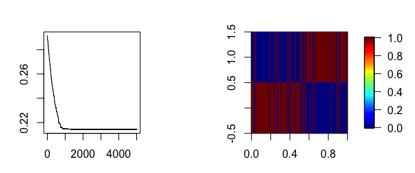
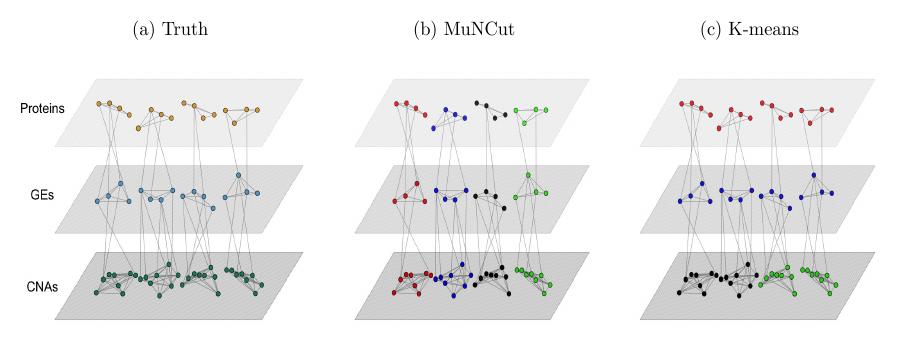

```{r setup, include = FALSE}
knitr::opts_chunk$set(
  collapse = TRUE,
  comment = "#>"
)
```

# Table of contents
1. [Description](#description)
2. [NCut](#ncut)
3. [ANCut](#ancut)
4. [MuNCut](#muncut)
5. [PWNCut](#pwncut)
6. [MLBNCut](#mlbncut)
7. [AWNCut](#awncut)


# Description

The NCutYX package includes functions for clustering genomic data using graph theory. Each function in this package is a variation on the NCut measure used to cluster vertices in a graph. The running theme is to use data sets from different sources and types to improve the clustering results.

* The ncut function clusters the columns of a data set using the classical normalized cut measure from graph theory. 
* The ancut function clusters one type of data, say gene expressions, with the help of a second type of data, like copy number aberrations.
* The muncut function clusters a three-layered graph into K different clusters of 3 different data types, say gene expression, copy number aberrations and proteins. 
* The pwncut function clusters the columns of X into K clusters by giving a weight for each cluster while penalizing them to be similar to each other.
* The mlbncut function works similarly to muncut but it also clusters samples 
into R clusters.
* The awncut builds similarity matrices for the row of X and an assisted dataset Z. Clusters them into K groups while conducting feature selection based on the AWNCut method.


To install:

* latest development version: 
    1. install and load package devtools
    2. `install_github("Seborinos/NCutYX")`

# NCut

The Normalized Cut (NCut) clusters the columns of Y into K groups using the NCut graph measure. Builds a similarity matrix for the columns of Y and clusters them into K groups based on the NCut graph measure. Correlation, Euclidean and Gaussian distances can be used to construct the similarity matrix. The NCut measure is minimized using the cross entropy method, a Monte Carlo optimization technique. 

## Method

Consider a dataset with $n$ iid samples. For the $i$th sample, assume that measurements are available on $p$ variables, denoted as $Y_i = (Y_{i1}, Y_{i2}, \cdots, Y_{ip})'$. Define the weight matrix $\mathbf{W}=(w_{jl})_{p\times p}$, where the non-negative element $w_{jl}$ measures the similarity between columns $j$ and $l$ of $\mathbf{Y}$. We can define $w_{jl}$ to be equal the Gaussian kernel, the absolute value of the sample correlation or the inverse of their Euclidean distance. Denote $A=\{A_1, \ldots, A_K\}$ as a partition of $\{1, \ldots, p \}$ which leads to $K$ disjoint clusters. For a set $A_k$, denote $A_k^c$ as its complement. Then, the NCut measure is defined as
\[
\text{NCut}(A)=\sum \limits_{k=1}^{K}\frac{\text{cut}(A_k,A_k^c;\mathbf{W})}
{\text{cutvol}(A_k;\mathbf{W} )},
\]
where
\[
	\text{cut}(A_k,A_k^c;\mathbf{W})=\sum \limits_{j\in A_k,l \in A_k^c} w_{jl},
\]
and
\[
	\text{cutvol}(A_k; \mathbf{W})=\sum \limits_{j,l \in A_k} w_{jl}.
\]
With a fixed $K$, the optimal clustering minimizes the NCut measure. The minimization is done with the cross entropy method, a Monte Carlo optimization approach.

## Example

First, we set up the simulation parameters.
```{r eval=FALSE}
library(MASS)
n <- 100 # Sample size
B <- 30 # Number of iterations in the simulated annealing algorithm.
p <- 50 # Number of columns of Y.
```

We define the covariance matrix, the true incidence function and sample the data.
```{r eval=FALSE}
S <- matrix(0.2, p, p)
S[1:(p/2),(p/2+1):p] <- 0
S[(p/2+1):p,1:(p/2)] <- 0
S <- S-diag(diag(S)) + diag(p)
mu <- rep(0, p)

W0 <- matrix(1,p,p)
W0[1:(p/2),1:(p/2)] <- 0
W0[(p/2+1):p,(p/2+1):p] <- 0
Denum <- sum(W0)

Y <- mvrnorm(n, mu, S)
```

Apply ncut to the data Y and calculate the estimation error of the clusters.
```{r eval=FALSE}
Res <- ncut(Y,
            K     = 2,
            B     = 30,
            N     = 1000,
            dist  = 'correlation',
            scale = TRUE,
            q     = 0.2,
            sigma = 0.1)
            
Cx  <- Res[[2]]
f11 <- matrix(Cx[ ,1], p, 1)
f12 <- matrix(Cx[ ,2], p, 1)

errorL <- sum((f11%*%t(f11))*W0)/Denum + sum((f12%*%t(f12))*W0)/Denum
# This is the true error of the clustering solution.
errorL
```

## References:

* [Von Luxburg, Ulrike. "A tutorial on spectral clustering." *Statistics and computing* 17.4 (2007): 395-416.](http://www.kyb.mpg.de/fileadmin/user_upload/files/publications/attachments/Luxburg07_tutorial_4488%5b0%5d.pdf)

* [Kroese, D. P., Rubinstein, R. Y., Cohen, I., Porotsky, S., & Taimre, T. (2013). *Cross-entropy method* 
  In Encyclopedia of Operations Research and Management Science (pp. 326-333). Springer US.](http://citeseerx.ist.psu.edu/viewdoc/download?doi=10.1.1.399.7005&rep=rep1&type=pdf)

# ANCut

The Assisted NCut (ANcut) clusters the columns of a data set $Y$ into $K$ groups with the help of an external data set $X$, which is associated linearly with $Y$. 

## Method

Consider a dataset with $n$ iid samples. For the $i$th sample, assume that measurements are available on $p$ gene expressions (GEs), denoted as $Y_i = (Y_{i1}, Y_{i2}, \cdots, Y_{ip})'$. In addition, assume that measurements are also available on $q$ copy number aberrations (CNAs), denoted as $X_i = (X_{i1}, X_{i2}, \cdots, X_{iq})'$. For another type of data, the proposed approach is directly applicable. Our strategy is to use information in $X_i$'s to assist the clustering of $Y_i$'s. We describe the $Y$-$X$ association using regression. Specifically, consider
\[
Y_i=\mathbf{\beta}X_i+\epsilon_i,
\]

where $\mathbf{\beta}$ is the matrix of unknown regression coefficients, and $\epsilon_i$ is the vector of random errors. This form is especially suitable for analysis when $Y$ and $X$ have high-dimension. For estimating $\mathbf{\beta}$, we consider the penalized estimate
\[
\widehat{\mathbf{\beta}}=\underset{\mathbf{\beta}}{\textrm{argmin}}\left\{
||\mathbf{Y}-\mathbf{\beta}\mathbf{X}||_2^2+\lambda\left((1-\alpha)||\mathbf{\beta}||^2_2 + \alpha||\mathbf{\beta}||_1\right)\right\},
\]
where $\mathbf{Y}$ and $\mathbf{X}$ are matrices consisting of $Y_i$'s and $X_i$'s, and $\lambda>0$ and $0\leq \alpha \leq 1$ are data-dependent tuning parameters. The penalization approach is adopted to accommodate the high data dimensionality and for selection: a specific $Y$ is expected to be affected by only a few $X$'s, and a $X$ is expected to affect only a few $Y$'s. The elastic net (Enet) penalty is adopted for its simplicity and to accommodate (possibly high) correlations among $X$'s. This estimation is effectively realized using R package $glmnet$. The two tuning parameters $\lambda$ and $\alpha$ are selected using V-fold cross validation.

With the estimate $\widehat{\mathbf{\beta}}$, denote the ``predicted'' $Y$ values as $\widehat{\mathbf{Y}}=\widehat{\mathbf{\beta}} \mathbf{X}$, which describe the component of GE directly regulated by the regulators. Accordingly, $\mathbf{Y}^c= \mathbf{Y} \setminus \widehat{\mathbf{Y}}$ describes the levels of GEs regulated by other regulators (that are not included in $\mathbf{X}$) as well as affected by other mechanisms.

For GEs, consider the weight matrix $\mathbf{W}=(w_{jl})_{p\times p}$, where the non-negative element $w_{jl}$ measures the similarity between gene $j$ and $l$. For a pair of the original GE measurements (as included in $\mathbf{Y}$), we define $w_{jl}$ equal to the inverse of their Euclidean distance. Note that there are multiple ways of defining the similarity. This definition is adopted because of its simplicity. It shares the same spirit as the popular K-means approach. Further, we define $\widehat{\mathbf{W}}$, which is defined in a similar way as $\mathbf{W}$ but using $\widehat{\mathbf{Y}}$, the regulated component of GEs.

Denote $A=\{A_1, \ldots, A_K\}$ as a partition of $\{1, \ldots, p \}$ which leads to $K$ disjoint clusters. For a set $A_k$, denote $A_k^c$ as its complement. We propose the ANCut (Assisted NCut) measure as
\[
\text{ANCut}(A)=\sum \limits_{k=1}^{K}\frac{\text{cut}(A_k,A_k^c;\mathbf{W})}
{\text{cutvol}(A_k;\widehat{\mathbf{W}} )},
\]
where
\[
	\text{cut}(A_k,A_k^c;\mathbf{W})=\sum \limits_{j\in A_k,l \in A_k^c} w_{jl},
\]
and
\[
	\text{cutvol}(A_k; \widehat{\mathbf{W}})=\sum \limits_{j,l \in A_k} \widehat{w}_{jl}.
\]
With a fixed $K$, the optimal clustering minimizes the ANCut measure. The minimization can be done with simulated annealing.

## Simulation Example

First we define some of the simulation parameters below.
```{r eval=FALSE}
n  <- 200 # Sample size
B  <- 5000 # Number of iterations in the simulated annealing algorithm.
L  <- 10000 # Temperature coefficient.
p  <- 200 # Number of columns of Y.
q  <- p # Number of columns of X.
h1 <- 0.05 # Lower bound for the B coefficiens in Y = X*B+e.
h2 <- 0.15 # Upper bound for the B coefficients in the model Y = X*B+e.
```
 
The data will be simulated as `Y = X*B + e` where X will be normal with a convariance matrix S with 2 blocks of correlated variables. This induces the correlation among the Y's as well. `W0` is an incidence matrix that will be used to calculate the error of the procedure.
```{r eval=FALSE}
 S <- matrix(0.2,q,q)
 S[1:(q/2),(q/2+1):q] <- 0
 S[(q/2+1):q,1:(q/2)] <- 0
 S <- S - diag(diag(S)) + diag(q)
 
 mu <- rep(0,q)

 W0 <- matrix(1,p,p)
 W0[1:(p/2),1:(p/2)] <- 0
 W0[(p/2+1):p,(p/2+1):p] <- 0

 B <- matrix(0,q,p)
 for (i in 1:(p/2)){
    B[1:(q/2),i] <- runif(q/2, h1, h2)
    in1          <- sample.int(q/2, 6)
    B[-in1,i]    <- 0#This makes B sparse.
 }

 for (i in (p/2+1):p){
    B[(q/2+1):q,i] <- runif(q/2, h1, h2)
    in2            <- sample(seq(q/2+1,q), 6)
    B[-in2,i]      <- 0 # This makes B sparse.
 }

 X <- mvrnorm(n, mu, S)
 Z <- X%*%B
 Y <- Z + matrix(rnorm(n*p,0,2), n, p)
```
We apply the function ANCut to Y which will cluster the columns into K=2 groups. It uses the help of X. First, it creates a model of Y=XB+e using the elastic net. You can choose the number of cross-validations with ncv and the parameter alpha in the penalty of the elastic net. 

```{r eval=FALSE}
# ANCut method
Res <- anut(Y, X, B, L, K=2, alpha = 0, ncv = 5)
Cx  <- Res[[2]]
f11 <- matrix(Cx[ ,1], p, 1)
f12 <- matrix(Cx[ ,2], p, 1)

errorL <- sum((f11%*%t(f11))*W0)/Denum+sum((f12%*%t(f12))*W0)/p^2
# This is the true error of the clustering solution.
errorL
```
 
 If you wish to plot the results you can do:
```{r eval=FALSE}
# Below is a plot of the simulated annealing path
plot(Res[[1]], type='l')
# Clusters found by ANCut
image.plot(Cx)
```
 On the left panel we see the path of the objective function as it is minimized through simulated annealing. On the right are represented the clusters. The perfect solution is a perfect checker board panel and the ANCut solution misses slightly. As n or h2 are increased, the solution will get closer to the true cluster structure of the data.




## References:

* [Hidalgo, Sebastian J. Teran, Mengyun Wu, and Shuangge Ma. "Assisted clustering of gene expression data using ANCut." *BMC genomics* 18.1 (2017): 623.](https://www.ncbi.nlm.nih.gov/pmc/articles/PMC5559859/)

# MuNCut

This example shows how to use the muncut function. The Multilayer NCut (MuNCut) clusters the columns of data from 3 different sources. It clusters the columns of $Z$, $Y$ and $X$ into $K$ clusters by representing each data type as one network layer. It represents the $Z$ layer depending on $Y$, and the $Y$ layer depending on $X$. Elastic net can be used before the clustering procedure by using the predictions of $Z$ and $Y$ instead of the actual values to improve the cluster results. The function muncut will output $K$ clusters of columns of $Z$, $Y$ and $X$.

## Method 

Denote $Z=(Z_1, \ldots, Z_q)$, $Y=(Y_1, \ldots, Y_p)$, and $X=(X_1, \ldots, X_r)$ as the length $q$, $p$, and $r$ vectors of proteins, GEs, and CNVs, respectively. With multilayer data both within- and across-layer connections need to be considered.

## NCut clustering within the same layers

First consider one data type or one layer, for example CNVs. Denote $\mathbf{W}_{C}=(w_{jl,c})_{r \times r}$ as the weight matrix, where the non-negative element $w_{jl,c}$ measures the similarity between CNVs $j$ and $l$. We set $w_{jl,c}$ equal to the Gaussian kernel. Denote $A_{1,C}, \ldots, A_{K,C}$ as a partition of $\{1, \ldots, r \}$ which leads to $K$ disjoint CNV clusters. Here in the subscript, ``$C$'' is used to represent CNV. For $A_{k,C}$, denote $A_{k,C}^c$ as its complement set. Consider the NCut measure
\begin{eqnarray}\label{eq:ncut.cnv}
\mbox{NCut}_C=
\sum \limits_{k=1}^{K}\frac{\text{cut}(A_{k,C},A_{k,C}^c;\mathbf{W}_C)}
{\text{cutvol}(A_{k,C}; \mathbf{W}_C )},
\end{eqnarray}
where
\begin{equation}\label{eq:cuty}
	\text{cut}(A_{k,C},A_{k,C}^c;\mathbf{W}_C)=\sum \limits_{j\in A_{k,C},l \in A_{k,C}^c} w_{jl,c},
\end{equation}
and
\begin{equation}\label{eq:cutvoly}
	\text{cutvol}(A_{k,C}; \mathbf{W}_C)=\sum \limits_{j,l \in A_{k,C}} {w}_{jl,c}.
\end{equation}
In a similar way, we can define the NCut measures for GEs and proteins and denote them as $\mbox{NCut}_G$ and $\mbox{NCut}_P$, respectively. Note that each layer has its own weight matrix, namely $\mathbf{W}_C$, $\mathbf{W}_G$, and $\mathbf{W}_P$. Overall, define the single-layer NCut measure as
\begin{eqnarray}\label{within}
\mbox{NCut}_{single}=\mbox{NCut}_C+\mbox{NCut}_G+\mbox{NCut}_P.
\end{eqnarray}
The optimal cutting is defined as the one that minimizes $\mbox{NCut}_{single}$. Note that $\mbox{NCut}_{single}$ does not take into account the regulations (interconnections) across layers, and working with this measure is equivalent to conducting the NCut clustering with each layer individually.

## NCut clustering across layers

In the above subsection, we have focused on the interconnections (similarity) for omics measurements within the same layers. Now we consider the interconnections between omics measurements belonging to different layers (for example, CNVs and GEs). Following the literature \cite{shi2015deciphering}, we first adopt a regression-based approach to describe the regulations. Specifically, consider the models:
\begin{eqnarray}\label{regress.model}
Y=X\mathbf{\beta_1}+\epsilon_1, ~~ Z=Y\mathbf{\beta_2}+\epsilon_2,
\end{eqnarray}
where $\mathbf{\beta_1}$ and $\mathbf{\beta_2}$ are the $r\times p$ and $p\times q$ matrices of unknown regression coefficients, and $\epsilon_1$ and $\epsilon_2$ are random errors (which may also include regulation mechanisms not measured). Assume $n$ iid subjects. Denote $\mathbf{Y}$ and $\mathbf{X}$ as the data matrices composed of the $Y$'s and $X$'s, respectively. For estimating the regression coefficient matrices, we consider a penalized approach, where the estimate of $\mathbf{\beta_1}$ is defined as
\begin{equation}\label{eq:Enet1}
\widehat{\mathbf{\beta_1}}=\underset{\mathbf{\beta}}
{\textrm{argmin}}\left\{||\mathbf{Y}-\mathbf{X}\mathbf{\beta_1}||_2^2+
\lambda\left((1-\alpha)||\mathbf{\beta_1}||^2_2 + \alpha||\mathbf{\beta_1}||_1\right)\right\}.
\end{equation}
$\lambda>0$ and $0\leq \alpha\leq 1$ are data-dependent tuning parameters, and $||\cdot||_{2(1)}$ denotes the $\ell_{2(1)}$ norm. The estimate of $\mathbf{\beta_2}$ can be defined in a similar manner. With the estimates, define $\mathbf{\widehat{Y}}=\mathbf{X}\mathbf{\widehat{\beta_1}}$ and $\mathbf{\widehat{Z}}=\mathbf{Y}\mathbf{\widehat{\beta_2}}$.


For $(\mathbf{X}, \mathbf{\widehat{Y}}, \mathbf{\widehat{Z}})$, the length $r+p+q$ ``mega'' vector of omics measurements, define the $(r+p+q)\times (r+p+q)$ weight matrix
\begin{eqnarray}
\mathbf{\widetilde{W}}= \left(
\begin{array}{ccc}
\mathbf{0} & \mathbf{W_{\widehat{Z}:\widehat{Y}}} & \mathbf{0}\\
\mathbf{W_{\widehat{Z}:\widehat{Y}}}^T & \mathbf{0} & \mathbf{W_{\widehat{Y}:X}}\\
\mathbf{0} & \mathbf{W_{\widehat{Y}:X}}^T & \mathbf{0}
\end{array}
\right),
\end{eqnarray}
where $\mathbf{0}$ denotes a matrix with all components zero (note that in different places, it may have different dimensions), $\mathbf{W_{\widehat{Z}:\widehat{Y}}}$ and $\mathbf{W_{\widehat{Y}:X}}$ are the matrices of similarity between $\mathbf{\widehat{Z}}$ and $\mathbf{\widehat{Y}}$, and between $\mathbf{\widehat{Y}}$ and $\mathbf{X}$ respectively, and the superscript $T$ denotes transpose. 

For a partition of $\{1, \ldots, r+p+q \}$ (which leads to a clustering structure), using $\mathbf{\widetilde{W}}$, we can compute the NCut measure $\mbox{NCut}_{multi}$ in the same manner as in $\mbox{NCut}_C$.

## MuNCut Objective Function

With a fixed $K$, let $A=\{A_1, \ldots, A_K \}$ denotes a disjoint partition of the CNVs, GEs, and proteins. Note that the cluster represented by $A_k$ may contain multiple types of omics measurements. For $A_k$ denote $A_{k, C}$, $A_{k, G}$, and $A_{k, P}$ as its components that are CNVs, GEs, and proteins, respectively. For $A$, we define its MuNCut measure as
\begin{eqnarray}\label{overall}
\mbox{MuNCut}(A)=\mbox{NCut}_{multi}+\gamma \times \mbox{NCut}_{single},
\end{eqnarray}
where $\mbox{NCut}_{multi}$ and $\mbox{NCut}_{single}$ are as defined above, and $\gamma\geq 0$ is a tuning parameter. The optimal clustering is defined as the one that minimizes $\mbox{MuNCut}(A)$.

## Toy Example

Three data types are considered: proteins in the upper layer; gene expressions in the middle layer; and CNVs in the lower layer. One dot represents one variable. Two dots are connected by a line if the corresponding variables are interconnected. Left panel: the true data structure with four clusters. Middle panel: MuNCut clustering. Right panel: K-means clustering. For K-means and MuNCut, different clusters are represented using different colors.

{width=275px, height=275px}

## Simulation Example
First, we define the simulation parameters, including the covariance matrix S of the $X$'s.
```{r eval=FALSE}
n   <- 50
p   <- 50
h   <- 0.5
rho <- 0.5

Sigma <- matrix(rho,p,p)
Sigma[1:(p/5),1:(p/5)] <- 2*rho
Sigma[(p/5+1):(3*p/5),(p/5+1):(3*p/5)] <- 2*rho
Sigma[(3*p/5+1):(4*p/5),(3*p/5+1):(4*p/5)] <- 2*rho
Sigma <- Sigma - diag(diag(Sigma))
Sigma <- Sigma + diag(p)
```

The matrix W0 will be used to evaluate how close the estimate is to the true cluster structure.
```{r eval=FALSE}
W0 <- matrix(1,p,p)
W0[1:(p/5),1:(p/5)] <- 0
W0[(p/5+1):(3*p/5),(p/5+1):(3*p/5)] <- 0
W0[(3*p/5+1):(4*p/5),(3*p/5+1):(4*p/5)] <- 0
W0[(4*p/5+1):p,(4*p/5+1):p] <- 0
W0 <- cbind(W0,W0,W0)
W0 <- rbind(W0,W0,W0)
```

The code below shows how to sample the data from three layers. The multilayer network is such that $\mathbf{X}$ is the base layer, $\mathbf{Y}$ is the second layer which depends on $\mathbf{X}$, and $\mathbf{Z}$ is the third layer which depends on $\mathbf{Y}$.
```{r eval=FALSE}
Y <- matrix(0, n, p)
Z <- matrix(0, n, p)

X  <- mvrnorm(n, rep(0, p), Sigma)
B1 <- matrix(0, p, p)
B2 <- matrix(0, p, p)

B1[1:(p/5),1:(p/5)]                     <- runif((p/5)^2, h/2, h)*rbinom((p/5)^2, 1, 0.2)
B1[(p/5+1):(3*p/5),(p/5+1):(3*p/5)]     <- runif((2*p/5)^2, h/2, h)*rbinom((2*p/5)^2, 1, 0.2)
B1[(3*p/5+1):(4*p/5),(3*p/5+1):(4*p/5)] <- runif((p/5)^2, h/2, h)*rbinom((p/5)^2, 1, 0.2)

B2[1:(p/5),1:(p/5)]                     <- runif((p/5)^2, h/2, h)*rbinom((p/5)^2, 1, 0.2)
B2[(p/5+1):(3*p/5),(p/5+1):(3*p/5)]     <- runif((2*p/5)^2, h/2, h)*rbinom((2*p/5)^2, 1, 0.2)
B2[(3*p/5+1):(4*p/5),(3*p/5+1):(4*p/5)] <- runif((p/5)^2, h/2, h)*rbinom((p/5)^2, 1, 0.2)

Y <- X%*%B1 + matrix(rnorm(n*p, 0, 0.5), n, p)
Z <- Y%*%B2 + matrix(rnorm(n*p, 0, 0.5), n, p)
```

The code below computes clusters using the MuNCut measure. With `model = FALSE` the raw data $\mathbf{Y}$ and $\mathbf{Z}$ are used. If `model = TRUE`, the predictions $\widehat{\mathbf{Y}}$ and $\widehat{\mathbf{Z}}$ are used instead of $\mathbf{Y}$ and $\mathbf{Z}$, respectively.
```{r eval=FALSE}
clust <- muncut(Z,
                Y,
                X,
                K        = 4,
                B        = 15000,
                L        = 500,
                sampling = 'size',
                alpha    = 0.5,
                ncv      = 3,
                nlambdas = 20,
                sigma    = 10,
                scale    = TRUE,
                model    = FALSE,
                gamma    = 0.1)

A <- clust[[2]][ ,1]%*%t(clust[[2]][ ,1]) + clust[[2]][ ,2]%*%t(clust[[2]][ ,2]) +
     clust[[2]][ ,3]%*%t(clust[[2]][ ,3]) + clust[[2]][ ,4]%*%t(clust[[2]][ ,4])

errorK <- sum(A*W0)/(3*p)^2
errorK
```


### References:

* Sebastian J. Teran Hidalgo and Shuangge Ma. "Clustering Multilayer Omics Data using MuNCut." *Revise and resubmit.* 

## PWNCut

The Penalized Weighted NCut (PWNCut) clusters the columns of $X$ into $K$ clusters by giving a weighted cluster membership while shrinking weights towards each other.

### Simulation Example
This sets up the initial parameters for the simulation.
```{r eval=FALSE}
n <- 100 # Sample size
p <- 100 # Number of columns of Y.
K <- 3
```

This simulates the data:
```{r eval=FALSE}
C0            <- matrix(0,p,K)
C0[1:25,1]    <- matrix(1,25,1)
C0[26:75,1:3] <- matrix(1/3,50,3)
C0[76:100,3]  <- matrix(1,25,1)

A0 <- C0[ ,1]%*%t(C0[ ,1]) + C0[ ,2]%*%t(C0[ ,2]) +
      C0[ ,3]%*%t(C0[ ,3])
A0 <- A0 - diag(diag(A0)) + diag(p)

Z1 <- rnorm(n,0,2)
Z2 <- rnorm(n,0,2)
Z3 <- rnorm(n,0,2)

Y <- matrix(0,n,p)
Y[ ,1:25]   <-  matrix(rnorm(n*25, 0, 2), n, 25) + matrix(Z1, n, 25, byrow=FALSE)
Y[ ,26:75]  <-  matrix(rnorm(n*50, 0, 2), n, 50) + matrix(Z1, n, 50, byrow=FALSE) +
                matrix(Z2, n, 50, byrow=FALSE) + matrix(Z3, n, 50, byrow=FALSE)
Y[ ,76:100] <-  matrix(rnorm(n*25, 0, 2), n, 25) + matrix(Z3, n, 25, byrow=FALSE)
```

To use PWNCut use the function `pwncut`.
```{r eval=FALSE}
trial <- pwncut(Y,
                K       = 3,
                B       = 10000,
                L       = 1000,
                lambda  = 1.5,
                start   = 'default',
                scale   = TRUE,
                nstarts = 1,
                epsilon = 0,
                dist    = 'correlation',
                sigma   = 10)

A1 <- trial[[2]][ ,1]%*%t(trial[[2]][ ,1]) +
      trial[[2]][ ,2]%*%t(trial[[2]][ ,2]) +
      trial[[2]][ ,3]%*%t(trial[[2]][ ,3])

A1 <- A1 - diag(diag(A1)) + diag(p)

plot(trial[[1]], type='l')
errorL <- sum(abs(A0-A1))/p^2
errorL
```

### References: 

* Sebastian J. Teran Hidalgo, Mengyun Wu and Shuangge Ma. "Penalized and weighted clustering of gene expression data using PWNCut." *Submitted.* 

## MLBNCut

The Multilayer Biclustering NCut (MLBNCut) clusters the columns and the rows simultaneously of data from 3 different sources. It clusters the columns of $Z$,$Y$ and $X$ into $K$ clusters and the samples into $R$ clusters by representing each data type as one network layer. It represents the $Z$ layer depending on $Y$, and the $Y$ layer depending on $X$. This function will output $K$ clusters of columns of $Z$, $Y$ and $X$ and $R$ clusters of the samples.

### Simulation Example
This sets up the initial parameters for the simulation.
```{r eval=FALSE}
n   <- 50
p   <- 50
h   <- 0.15
rho <- 0.15
mu  <- 1
```

```{r eval=FALSE}
W0 <- matrix(1,p,p)
W0[1:(p/5),1:(p/5)] <- 0
W0[(p/5+1):(3*p/5),(p/5+1):(3*p/5)] <- 0
W0[(3*p/5+1):(4*p/5),(3*p/5+1):(4*p/5)] <- 0
W0[(4*p/5+1):p,(4*p/5+1):p]=0
W0=cbind(W0,W0,W0)
W0=rbind(W0,W0,W0)

W1 <- matrix(1,n,n)
W1[1:(n/2),1:(n/2)] <- 0
W1[(n/2+1):n,(n/2+1):n] <- 0
```

```{r eval=FALSE}
X <- matrix(0,n,p)
Y <- matrix(0,n,p)
Z <- matrix(0,n,p)

Sigma=matrix(0,p,p)
Sigma[1:(p/5),1:(p/5)] <- rho
Sigma[(p/5+1):(3*p/5),(p/5+1):(3*p/5)] <- rho
Sigma[(3*p/5+1):(4*p/5),(3*p/5+1):(4*p/5)] <- rho
Sigma[(4*p/5+1):p,(4*p/5+1):p] <- rho
Sigma <- Sigma - diag(diag(Sigma))
Sigma <- Sigma + diag(p)

X[1:(n/2),]   <- mvrnorm(n/2,rep(mu,p),Sigma)
X[(n/2+1):n,] <- mvrnorm(n/2,rep(-mu,p),Sigma)

B11 <- matrix(0,p,p)
B12 <- matrix(0,p,p)
B21 <- matrix(0,p,p)
B22 <- matrix(0,p,p)

B11[1:(p/5),1:(p/5)]                     <- runif((p/5)^2, h/2, h)*rbinom((p/5)^2, 1, 0.5)
B11[(p/5+1):(3*p/5),(p/5+1):(3*p/5)]     <- runif((2*p/5)^2, h/2, h)*rbinom((2*p/5)^2, 1, 0.5)
B11[(3*p/5+1):(4*p/5),(3*p/5+1):(4*p/5)] <- runif((p/5)^2, h/2, h)*rbinom((p/5)^2, 1, 0.5)
B11[(4*p/5+1):p,(4*p/5+1):p]             <- runif((1*p/5)^2, h/2, h)*rbinom((1*p/5)^2, 1, 0.5)

B12[1:(p/5),1:(p/5)]                     <- runif((p/5)^2, -h, -h/2)*rbinom((p/5)^2, 1, 0.5)
B12[(p/5+1):(3*p/5),(p/5+1):(3*p/5)]     <- runif((2*p/5)^2, -h, -h/2)*rbinom((2*p/5)^2, 1, 0.5)
B12[(3*p/5+1):(4*p/5),(3*p/5+1):(4*p/5)] <- runif((p/5)^2, -h, -h/2)*rbinom((p/5)^2, 1, 0.5)
B12[(4*p/5+1):p,(4*p/5+1):p]             <- runif((1*p/5)^2, -h, -h/2)*rbinom((1*p/5)^2, 1, 0.5)

B21[1:(p/5),1:(p/5)]                     <- runif((p/5)^2, h/2, h)*rbinom((p/5)^2,1,0.5)
B21[(p/5+1):(3*p/5),(p/5+1):(3*p/5)]     <- runif((2*p/5)^2, h/2, h)*rbinom((2*p/5)^2,1,0.5)
B21[(3*p/5+1):(4*p/5),(3*p/5+1):(4*p/5)] <- runif((p/5)^2, h/2, h)*rbinom((p/5)^2,1,0.5)
B21[(4*p/5+1):p,(4*p/5+1):p]             <- runif((1*p/5)^2, h/2, h)*rbinom((1*p/5)^2,1,0.5)

B22[1:(p/5),1:(p/5)]                     <- runif((p/5)^2, -h, -h/2)*rbinom((p/5)^2, 1, 0.5)
B22[(p/5+1):(3*p/5),(p/5+1):(3*p/5)]     <- runif((2*p/5)^2, -h, -h/2)*rbinom((2*p/5)^2, 1, 0.5)
B22[(3*p/5+1):(4*p/5),(3*p/5+1):(4*p/5)] <- runif((p/5)^2, -h, -h/2)*rbinom((p/5)^2, 1, 0.5)
B22[(4*p/5+1):p,(4*p/5+1):p]             <- runif((1*p/5)^2, -h, -h/2)*rbinom((1*p/5)^2, 1, 0.5)

Y[1:(n/2), ]   <- X[1:(n/2),]%*%B11+matrix(rnorm((n/2)*p, 0, 0.25), n/2, p)
Y[(n/2+1):n, ] <- X[(n/2+1):n,]%*%B12+matrix(rnorm((n/2)*p, 0, 0.25), n/2, p)

Z[1:(n/2), ]   <- Y[1:(n/2),]%*%B21+matrix(rnorm((n/2)*p, 0, 0.25),n/2,p)
Z[(n/2+1):n, ] <- Y[(n/2+1):n,]%*%B22+matrix(rnorm((n/2)*p, 0, 0.25),n/2,p)
```


```{r eval=FALSE}
trial <- mlbncut(Z,
                 Y,
                 X,
                 K=4,
                 R=2,
                 B=10,
                 N=100,
                 dist='correlation',
                 q0=0.15,
                 scale=TRUE,
                 sigmas=0.05,
                 sigmac=1)

plot(trial[[1]],type='l')
image.plot(trial[[2]])
image.plot(trial[[3]])

errorK <- sum((trial[[3]][ ,1]%*%t(trial[[3]][ ,1]) +
               trial[[3]][ ,2]%*%t(trial[[3]][ ,2]) +
               trial[[3]][ ,3]%*%t(trial[[3]][ ,3]) +
               trial[[3]][ ,4]%*%t(trial[[3]][ ,4]))*W0)/(3*p)^2 +
          sum((trial[[2]][ ,1]%*%t(trial[[2]][ ,1]) +
               trial[[2]][ ,2]%*%t(trial[[2]][ ,2]))*W1)/(n)^2
errorK
```

### References: 

* Sebastian J. Teran Hidalgo and Shuangge Ma. "Multilayer Biclustering of Omics Data using MLBNCut." *Work in progress.* 

## AWNCut

The Assisted Weighted NCut builds the similarity matrices for the rows of $X$ and an assisted dataset $Z$. Clusters them into $K$ groups while conducting feature selection based on the AWNCut method.

### Simulation Example

```{r eval=FALSE}
set.seed(123456)
#This sets up the initial parameters for the simulation.
lambda <- seq(2,6,1) #Tuning parameter lambda
Tau    <- seq(0.2,0.8,0.2) #Tuning parameter tau

n=30; n1=10; n2=10; n3=n-n1-n2 #Sample size
p1=30; p2=30; r1=28; r2=28; #Number of variables and noises in each dataset

K=3; #Number of clusters

mu=1; #Mean of the marginal distribution
u1=0.5; #Range of enties in the coefficient matrix

epsilon <- matrix(rnorm(n*(p1-r1),0,1), n, (p1-r1)) # Generation of random error

Sigma1 <- matrix(rep(0.8,(p1-r1)^2),(p1-r1),(p1-r1)) # Generation of the covariance matrix
diag(Sigma1) <- 1
```

```{r eval=FALSE}
# Generation of the original distribution of the three clusters
T1 <- matrix(rmvnorm(n1,mean=rep(-mu,(p1-r1)),sigma=Sigma1),n1,(p1-r1))
T2 <- matrix(rmvnorm(n2,mean=rep(0,(p1-r1)),sigma=Sigma1),n2,(p1-r1))
T3 <- matrix(rmvnorm(n3,mean=rep(mu,(p1-r1)),sigma=Sigma1),n3,(p1-r1))

X1 <- sign(T1)*(exp(abs(T1))) #Generation of signals in X
X2 <- sign(T2)*(exp(abs(T2)))
X3 <- sign(T3)*(exp(abs(T3)))
ep1 <- (matrix(rnorm(n*r1,0,1),n,r1)) #Generation of noises in X
X <- rbind(X1,X2,X3)

beta1 <- matrix(runif((p1-r1)*(p2-r2),-u1,u1),(p1-r1),(p2-r2)) #Generation of the coefficient matrix
Z     <- X%*%beta1+epsilon #Generation of signals in Z
ep2   <- (matrix(rnorm(n*r2,0.5,1),n,r2)) #Generation of noises in Z

X <- cbind(X,ep1)
Z <- cbind(Z,ep2)
```

```{r eval=FALSE}
# AWNCut method
Tune1         <- awncut.selection(X, Z, K, lambda, Tau, B = 30, L = 1000)
awncut.result <- awncut(X, Z, 3, Tune1$lam, Tune1$tau, B = 30, L = 1000)
ErrorRate(awncut.resu
```

### References: 

* Li, Yang; Bie, Ruofan; Teran Hidalgo, Sebastian; Qin, Yinchen; Wu, Mengyun; Ma, Shuangge. "Assisted gene expression-based clustering with AWNCut." *Submitted.* 
